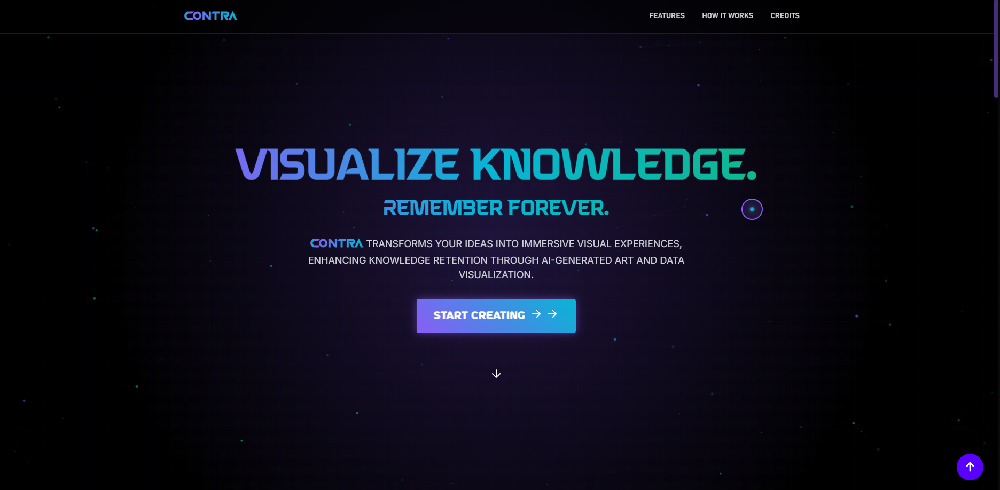

<div align="center">
  
  
  <h1>CONTRA</h1>
  <h3>Data-Driven Art Generator & Visual Storytelling Platform</h3>
  
  <p>
    <strong>Transform simple prompts into immersive digital experiences</strong>
  </p>
  
  <p>
    
    
    
    
  </p>
  
  <p>
    <a href="#features">✨ Features</a> •
    <a href="#setup-and-installation">🔧 Installation</a> •
    <a href="#usage-examples">📝 Usage</a> •
    <a href="#project-creators">👨‍💻 Creators</a> •
    <a href="#api-endpoints">🔌 API</a> •
    <a href="#credits">📚 Credits</a>
  </p>
  
  <br/>
  
  <p align="center">
    
  </p>
</div>

<h2 id="project-creators">👨‍💻 Project Creators</h2>

<table>
  <tr>
    <td width="50%" align="center">
      
      <br/>
      <strong>Subhro Pal</strong>
      <br/>
      <em>Lead Developer & UI/UX Designer</em>
      <br/>
      <small>Frontend implementation, responsive design, animations, and user experience</small>
    </td>
    <td width="50%" align="center">
      
      <br/>
      <strong>Yuvraj Singh Kushwah</strong>
      <br/>
      <em>Lead Architect & Backend Developer</em>
      <br/>
      <small>Data processing pipeline, API integrations, and server infrastructure</small>
    </td>
  </tr>
</table>

<h2 id="features">🌟 Features</h2>

<details open>
  <summary><strong>Core Capabilities</strong></summary>
  <br/>
  
  <table>
    <tr>
      <td width="50%">
        <strong>🔍 Contextual Data Enrichment</strong>
        <p>Automatically enriches user inputs with data from Wikipedia, DBpedia, and current news</p>
      </td>
      <td width="50%">
        <strong>🖼️ AI Art Generation</strong>
        <p>Creates high-fidelity images using Stable Diffusion 3.5 with customizable styles, emotions, and variations</p>
      </td>
    </tr>
    <tr>
      <td>
        <strong>📝 Narrative Synthesis</strong>
        <p>Produces coherent, engaging narratives with bullet points and detailed explanations</p>
      </td>
      <td>
        <strong>📊 Interactive Visualizations</strong>
        <p>Generates timelines, category graphs, and concept maps to visualize relationships</p>
      </td>
    </tr>
    <tr>
      <td>
        <strong>😃 Sentiment Analysis</strong>
        <p>Analyzes the overall sentiment around topics based on current data</p>
      </td>
      <td>
        <strong>📚 Creative Storytelling</strong>
        <p>Creates short stories, poems, or scripts inspired by user topics</p>
      </td>
    </tr>
  </table>
</details>

<details>
  <summary><strong>UI/UX Features</strong></summary>
  <br/>
  
  <table>
    <tr>
      <td width="50%">
        <strong>📱 Responsive Design</strong>
        <p>Fully responsive UI that works seamlessly on desktop, tablet, and mobile devices</p>
      </td>
      <td width="50%">
        <strong>🌈 Modern UI</strong>
        <p>Glass morphism effects, 3D interactions, and smooth animations enhance user experience</p>
      </td>
    </tr>
    <tr>
      <td>
        <strong>🖱️ Custom Cursor</strong>
        <p>Interactive custom cursor with dynamic feedback on desktop devices</p>
      </td>
      <td>
        <strong>🌐 Cross-Browser Support</strong>
        <p>SVG and ICO favicons for wide browser compatibility</p>
      </td>
    </tr>
  </table>
</details>

<h2 id="technologies">🚀 Technologies</h2>

<details open>
  <summary><strong>Technology Stack</strong></summary>
  <br/>
  
  <table>
    <tr>
      <th>Category</th>
      <th>Technologies</th>
    </tr>
    <tr>
      <td><strong>Backend</strong></td>
      <td>
        
        
        
        
      </td>
    </tr>
    <tr>
      <td><strong>Frontend</strong></td>
      <td>
        
        
        
        
      </td>
    </tr>
    <tr>
      <td><strong>AI Models</strong></td>
      <td>
        
        
      </td>
    </tr>
    <tr>
      <td><strong>Data Sources</strong></td>
      <td>
        
        
        
      </td>
    </tr>
  </table>
</details>

<h2 id="project-structure">🛠️ Project Structure</h2>

```
contra/
│
├── app.py                   # Main Flask application
├── config.py                # Configuration settings
│
├── core/                    # Core functionality
│   ├── data_fetcher.py      # Retrieve contextual data
│   ├── image_generator.py   # Generate images via Stable Diffusion
│   ├── narrative_generator.py # Generate narratives via LLaMA
│   └── visualizer.py        # Create data visualizations
│
├── utils/                   # Utility functions
│   ├── cache.py             # Caching mechanisms
│   ├── validators.py        # Input validation
│   └── helpers.py           # General helper functions
│
├── services/                # External API integrations
│   ├── groq_client.py       # Groq LLaMA API client
│   ├── stable_diffusion.py  # Stable Diffusion API client
│   ├── wikipedia_service.py # Wikipedia API client
│   ├── dbpedia_service.py   # DBpedia SPARQL client
│   └── news_service.py      # News API client
│
├── models/                  # Data models
│   └── data_model.py        # Input/output data models
│
├── templates/               # Flask templates
│   ├── layout.html          # Base template with shared elements
│   ├── index.html           # Main application page
│   ├── about.html           # About page
│   ├── status.html          # System status page
│   └── 404.html             # Error page
│
├── static/                  # Static assets (CSS, JS, images)
│   ├── css/
│   │   ├── styles.css       # Main stylesheet
│   │   ├── components.css   # Component styles
│   │   ├── custom-cursor.css # Custom cursor styles
│   │   └── theme.css        # Theme variables
│   ├── js/
│   │   ├── animations.js    # GSAP animations
│   │   ├── custom-cursor.js # Custom cursor logic
│   │   ├── particles.js     # Particle background
│   │   └── app.js           # Main application logic
│   └── img/
│       ├── icons/           # Icons and favicons
│       └── *.svg            # UI graphics
│
├── cache/                   # Cache directory
│   ├── images/              # Cached generated images
│   └── data/                # Cached API responses
│
└── requirements.txt         # Python dependencies
```

<h2 id="api-endpoints">📋 API Endpoints</h2>

CONTRA provides the following RESTful API endpoints:

<table>
  <tr>
    <th>Endpoint</th>
    <th>Method</th>
    <th>Description</th>
  </tr>
  <tr>
    <td><code>/api/generate</code></td>
    <td>POST</td>
    <td>Generate content for a topic</td>
  </tr>
  <tr>
    <td><code>/api/styles</code></td>
    <td>GET</td>
    <td>Get available image generation styles</td>
  </tr>
  <tr>
    <td><code>/api/related</code></td>
    <td>GET</td>
    <td>Get related topics for a given topic</td>
  </tr>
  <tr>
    <td><code>/api/sentiment</code></td>
    <td>POST</td>
    <td>Analyze sentiment for a topic</td>
  </tr>
  <tr>
    <td><code>/api/story</code></td>
    <td>POST</td>
    <td>Generate a creative story for a topic</td>
  </tr>
  <tr>
    <td><code>/api/health</code></td>
    <td>GET</td>
    <td>API health check</td>
  </tr>
  <tr>
    <td><code>/status</code></td>
    <td>GET</td>
    <td>System status dashboard with API connection information</td>
  </tr>
</table>

<h2 id="setup-and-installation">🔧 Setup and Installation</h2>

<h3>Prerequisites</h3>

- Python 3.8+
- Node.js 18.0+ (for frontend components)
- Groq API key for LLama 3.3
- Stability AI API key for Stable Diffusion 3.5
- GNews API key (for enhanced news article retrieval)

<h3>Installation Steps</h3>

<details open>
  <summary><strong>Quick Setup</strong></summary>
  
  1. Clone the repository:
     ```bash
     git clone https://github.com/yourusername/contra.git
     cd contra
     ```
  
  2. Create and activate a Python virtual environment:
     ```bash
     python -m venv venv
     source venv/bin/activate  # On Windows: venv\Scripts\activate
     ```
  
  3. Install Python dependencies:
     ```bash
     pip install -r requirements.txt
     ```
  
  4. Install Node.js dependencies:
     ```bash
     npm install
     ```
  
  5. Create a `.env` file with your API keys:
     ```
     GROQ_API_KEY=your_groq_api_key
     STABILITY_API_KEY=your_stability_ai_api_key
     NEWS_API_KEY=your_gnews_api_key
     FLASK_ENV=development
     ```
  
  6. Run the application:
     ```bash
     python run.py
     ```
  
  7. In a separate terminal, start the Node.js server (if using the frontend components):
     ```bash
     cd HOMEPAGE/HOMEPAGE
     ```
     ```bash
     node server.js
     ```
  
  8. Visit `http://localhost:8080` in your browser.
     
  9. Check API status at `http://localhost:5000/status`
</details>

<h2 id="responsive-design">📱 Responsive Design</h2>

<p align="center">
  
</p>

CONTRA features a fully responsive design with optimized layouts for:

<table>
  <tr>
    <td width="25%" align="center">
      
      <br/>
      <strong>Desktop</strong>
      <br/>
      <small>1280px+</small>
    </td>
    <td width="25%" align="center">
      
      <br/>
      <strong>Laptop</strong>
      <br/>
      <small>1024px+</small>
    </td>
    <td width="25%" align="center">
      
      <br/>
      <strong>Tablet</strong>
      <br/>
      <small>768px+</small>
    </td>
    <td width="25%" align="center">
      
      <br/>
      <strong>Mobile</strong>
      <br/>
      <small>480px+</small>
    </td>
  </tr>
</table>

<h3>Adaptive Features</h3>

- Collapsible navigation on small screens
- Responsive grid layouts for cards and content
- Touch-optimized interactions on mobile devices
- Reduced animations on low-power devices
- Accessible minimum touch targets (44px)

<h2 id="usage-examples">📝 Usage Examples</h2>

<h3>Generate Content</h3>

```bash
curl -X POST http://localhost:5000/api/generate \
  -H "Content-Type: application/json" \
  -d '{
    "topic": "French Revolution", 
    "tone": "dramatic", 
    "style": "oil painting", 
    "variants": 2
  }'
```

<h3>Generate Creative Story</h3>

```bash
curl -X POST http://localhost:5000/api/story \
  -H "Content-Type: application/json" \
  -d '{
    "topic": "Space Exploration", 
    "style": "short story", 
    "genre": "science fiction"
  }'
```

<h2 id="contributing">🤝 Contributing</h2>

Contributions are welcome! Please feel free to submit a Pull Request.

<h2 id="credits">📚 Credits</h2>

<h3>Technologies & Libraries</h3>

<table>
  <tr>
    <td width="33%" align="center">
      
      <br/>
      <small>Narrative synthesis and text generation</small>
    </td>
    <td width="33%" align="center">
      
      <br/>
      <small>Stable Diffusion image generation</small>
    </td>
    <td width="33%" align="center">
      
      <br/>
      <small>Interactive data visualizations</small>
    </td>
  </tr>
  <tr>
    <td align="center">
      
      <br/>
      <small>Python web framework</small>
    </td>
    <td align="center">
      
      <br/>
      <small>Advanced animations</small>
    </td>
    <td align="center">
      
      <br/>
      <small>3D effects and visualizations</small>
    </td>
  </tr>
</table>

<h3>Data Sources</h3>

- [Wikipedia API](https://www.mediawiki.org/wiki/API:Main_page) - For encyclopedic knowledge
- [DBpedia](https://www.dbpedia.org/) - For structured knowledge extraction
- [GNews](https://gnews.io/) - For current events and news articles

<h3>Inspiration</h3>

- This project was inspired by advances in generative AI and the potential for combining multiple data sources to create rich, context-aware digital experiences.

<h3>Contributors</h3>

- **Subhro Pal** - Lead Developer and UI/UX Designer who implemented the responsive design, custom animations,Node.js server, and integrated the AI generation components.
- **Yuvraj Singh Kushwah** - Lead Architect and Backend Developer who designed the data processing pipeline, API integrations infrastructure.
- Special thanks to the open source community for the libraries and tools that made this project possible.

<h2 id="license">📄 License</h2>

This project is licensed under the MIT License - see the LICENSE file for details. 